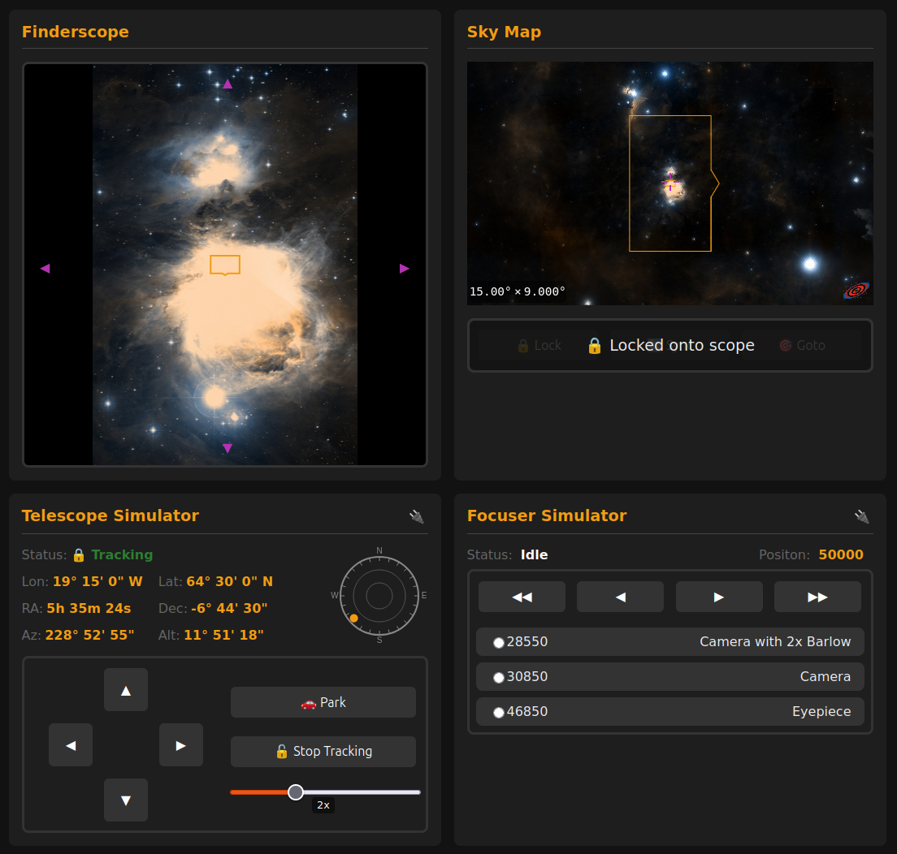
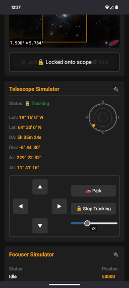
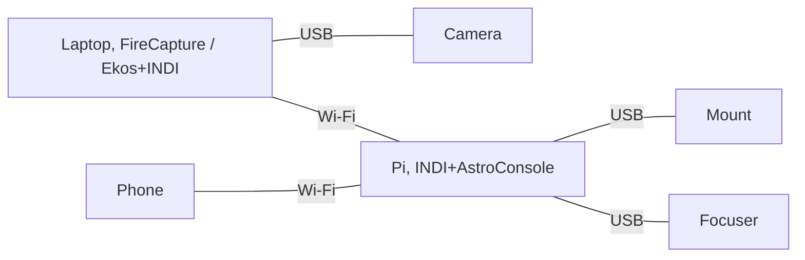
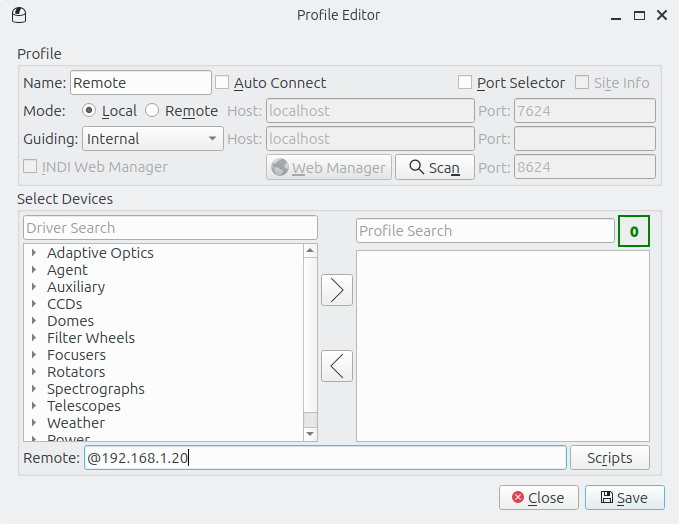

# AstroConsole


AstroConsole is a web app for controlling your telescope. It is lightweight enough to be installed on a Raspberry Pi Zero 2. You can then remotely control your telescope from any web browser, mobile or desktop.

AstroConsole uses INDI for interfacing with devices. Currently mount and focuser control is supported.





## Quick Start

* Ensure you have INDI server running and connected to a mount and/or focuser.
* Ensure you have Python 3 installed.
* Clone this repo.
* From within the clone, create a virtual environment: `python3 -m venv venv`.
* Install requirements `./venv/bin/pip install -r requirements.txt`.
* Run the [astroconsole](astroconsole) script within the virtual env: `./venv/bin/python3 ./astroconsole`.
* Visit the web UI at `http://yourip:8080`.

## Usage

```
usage: astroconsole [-h] [--config CONFIG] [--host HOST] [--port PORT] [--ws-port WS_PORT] [--indi-host INDI_HOST] [--indi-port INDI_PORT]

INDI Web

options:
  -h, --help            show this help message and exit
  --config CONFIG       Location of config file (default: ~/.config/astroconsole.json)
  --host HOST           Host to bind to (default: 127.0.0.1)
  --port PORT           Port to listen on (default: 8080)
  --ws-port WS_PORT     Port to listen on for websocket (default: 7626)
  --indi-host INDI_HOST
                        INDI host (default: 127.0.0.1)
  --indi-port INDI_PORT
                        INDI port (default: 7624)
```

## Run in systemd

Create a systemd service at `/etc/systemd/system/astroconsole.service`:

```
[Unit]
Description=AstroConsole
After=multi-user.target

[Service]
Type=idle
User=youruser
WorkingDirectory=/path/to/astroconsole
ExecStart=./venv/bin/python3 ./astroconsole
Restart=always
RestartSec=60

[Install]
WantedBy=multi-user.target
```

Enable and start the service

```
systemctl enable astroconsole.service
systemctl start astroconsole.service
```

## Config

Runtime config can be added to `~/.config/astroconsole.json`

```
{
    "devices": {
        "EQMod Mount": {
            "reverseRa": true,
            "reverseDecPierWest": false,
            "reverseDecPierEast": true
        },
        "ZWO EAF": {
            "presets": {
                "Camera with 2x Barlow": 28550,
                "Camera": 30850,
                "Eyepiece": 46850
            },
            backlashComp: 50
        }
    },
    "mount": {
      "name": "EQMod Mount"
    },
    "focuser": {
      "name": "ZWO EAF"
    },
    "finderscope": {
        "url": "http://192.168.1.20:8080/finderscope_test.png",
        "fovx": 5,
        "fovy": 3,
        "rotation": 0,
        "flipPierEast": true
    },
    "camera": {
        "fovx": 1,
        "fovy": 0.5,
        "rotation": 0,
        "flipPierEast": true
    }
}
```

| Path                                     | Type      | Default      | Description |
|------------------------------------------|-----------|--------------|-------------|
| devices.${mount_name}.reverseRa          | boolean   | false        | Reverse left/right buttons |
| devices.${mount_name}.reverseDecPierWest | boolean   | false        | Reverse up/down buttons when the pier side is west (pointing east) |
| devices.${mount_name}.reverseDecPierEast | boolean   | false        | Reverse up/down buttons when the pier side is east (pointing west) |
| devices.${focuser_name}.presets          | map       | {}           | A map of focuser presets to jump to, friendly name => focuser value |
| devices.${focuser_name}.backlashComp     | map       | 0            | When focusing outward, overshoot by the given amount then correct with an inward focus to compensate for backlash |
| mount.name                               | string    | *Autodetect* | The INDI device name for the mount, if not specified the first one seen will be used |
| focuser.name                             | string    | *Autodetect* | The INDI device name for the focuser, if not specified the first one seen will be used |
| finderscope.url                          | string    | *null*       | The URL of a video feed to a webcam being used as a finderscope, see below |
| finderscope.fovx                         | number    | *null*       | The horizontal FOV of your finderscope in decimal degrees, used to draw FOV squares |
| finderscope.fovy                         | number    | *null*       | The vertical FOV of your finderscope in decimal degrees, used to draw FOV squares |
| finderscope.rotation                     | number    | 0            | The rotation of your finderscope on your rig, so the UI can match, see below |
| finderscope.flipPierEast                 | boolean   | false        | Whether the rotation of your finderscope should be flipped when the pier side is east (pointing west) |
| camera.fovx                              | number    | *null*       | The horizontal FOV of your camera in decimal degrees, used to draw FOV squares |
| camera.fovy                              | number    | *null*       | The vertical FOV of your camera in decimal degrees, used to draw FOV squares |
| camera.rotation                          | number    | 0            | The rotation of your camera on your rig, so the UI can match, see below |
| camera.flipPierEast                      | boolean   | false        | Whether the rotation of your camera should be flipped when the pier side is east (pointing west) |

Note that some properties need their INDI device name including e.g. `devices.${mount_name}.reverseRa` might be `devices."EQMod Mount".reverseRa`. This allows multiple mounts/focusers to be used without needing to change the config file each time.

Changes to the config take effect when reloading the web UI. You do not need to restart AstroConsole.

### Finderscope Webcam

AstroConsole supports the use of a webcam as a digital finderscope. Your webcam needs to be streamable over HTTP, set the URL to your webcam using `finderscope.url`.

If you are running AstroConsole on a Pi you can plug a webcam into the Pi and install [µStreamer](https://github.com/pikvm/ustreamer) to make it available over HTTP.

### Aligning the Direction of Devices

All the devices in AstroConsole should be aligned such that up is towards the north celestial pole. Configure your devices in the following order:

**Sky Map**

* The sky map is configured by default. It can be used to help align the other devices.

**Mount Up/Down/Left/Right**

* Move your mount to point east, low on the horizon.
* Press left and the map should pan left, if it pans right set `devices.${mount_name}.reverseRa=true`.
* Press up and the map should pan up, if it pans down set `devices.${mount_name}.reverseDecPierWest=true`.
* Move your mount to point west, low on the horizon.
* Press up and the map should pan up, if it pans down set `devices.${mount_name}.reverseDecPierEast=true`.

**Finderscope and Camera**

* Move your mount to point east, low on the horizon.
* If your finderscope is upright in this position leave `finderscope.rotation=0`.
* If your finderscope is rotated clockwise 90 degrees set `finderscope.rotation=90`.
* Reload AstroConsole, the view from the finderscope should match the view from the map and pressing left/up should pan left/up.
* Move your mount to point west, low on the horizon.
* Normally at this point your camera will have flipped by 180, if so set `camera.flipPierEast=true`.
* Repeat for your camera if required.

## FAQs

### What mounts and focusers are supported?

In theory any mount/focuser supported by INDI should work. So far it has only been tested on the EQMod and ZWO EAF drivers. If it works for your device please let me know.

### How do I run INDI server?

There are many ways to run INDI server:

* Have [Kstars/Ekos](https://kstars.kde.org/) run it for you.
* Setup [Astroberry](https://www.astroberry.io/).
* Use [INDI Web Manager](https://github.com/knro/indiwebmanager).
* Run it directly via systemd.

I recommend installing INDI and AstroConsole on a Raspberry Pi (even a Zero 2 will do) and then using systemd to run them both automatically. The easiest path to installing INDI on the Pi is to install Ubuntu and then use the following package repo:

```
sudo apt-add-repository ppa:mutlaqja/ppa
sudo apt install indi-full
```

### How do I set my mount location, or other device settings?

You can set properties of your devices using `indi_setprop`, for example to set your location:

```
indi_setprop "EQMod Mount.GEOGRAPHIC_COORD.LAT=64.5;LONG=340.75;ELEV=100"
```

Latitude is between -90 and 90, longitude is between 0 and 360 where 20 east would be 20 and 20 west would be 340. Both are decimal

To set an EQMod Mount's USB device and baud rate:

```
indi_setprop "EQMod Mount.DEVICE_PORT.PORT=/dev/serial/by-id/my-webcam-name-port0"
indi_setprop "EQMod Mount.DEVICE_BAUD_RATE.115200=On"
```

To check they are set run `indi_getprop`, for example `indi_getprop "EQMod Mount.GEOGRAPHIC_COORD.*"`.

### What IP should I use to see the web UI?

The IP address needs to be a local one, rather than your public IP.

Normally, you would run AstroConsole on a Raspberry Pi that is connected to the same Wi-Fi network as your laptop or mobile. In this case, use the local IP address of the Pi, often something like `192.168.x.x` or `10.10.x.x`.

If you are running AstroConsole on the same laptop you are accessing it from, you can use `127.0.0.1`.

### Can I access the web UI over the internet?

With additional tools, yes.

⚠️  **Do not expose AstroConsole directly to the internet via your router’s port forwarding.** It does not have authentication and has not been security-hardened.

* Use a VPN such as [Tailscale](https://tailscale.com/) or [WireGuard](https://www.wireguard.com/) to access your internal network remotely, then use the local IP as above.  
* Proxy the web UI using a tunnel service such as [Ngrok](https://ngrok.com/) or [Cloudflare Tunnel](https://developers.cloudflare.com/cloudflare-one/connections/connect-networks/). Make sure you configure some authentication.

Note that there are at least a couple of ports that need to be exposed:

* The main web UI port, default 8080.
* The backend websocket port, default 7626.
* If you have a local finderscope URL, the IP/port for that.
* You do not need to expose the INDI port.

### How can I control my camera?

AstroConsole's main aim is to provide a lightweight way to control a telescope mount and focuser without needing a laptop. This is primarily to assist with visual astronomy. It can also be used as a companion app when doing planetary or DSO imaging, in conjunction with software such as FireCapture or Ekos, as follows:



This way you always have basic control of your rig via AstroConsole and can then quickly swap from visual to a full laptop setup by connecting a single cable to the camera, without disturbing your mount.

To connect Ekos to your camera directly at the same time as your mount/focuser via the INDI running on the Pi you can use INDI chaining as follows:



Where the IP in the remote field is the IP of your Pi.

Camera support may be added directly to AstroConsole at a later date.

## Author

© 2025 [Kieren Beckett](https://kierenb.net)

Distributed under the GNU General Public License v3.0. See [LICENSE](LICENSE) for more information.
